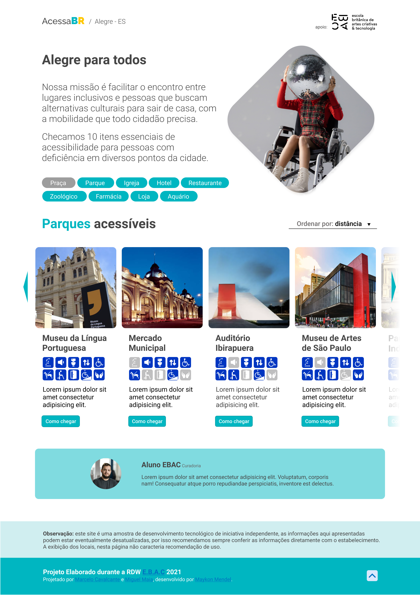

<h1 align="center">
  AcessaBR/Alegre-ES
</h1>

 

  

## 🚀 Tecnologias

Esse projeto foi desenvolvido com as seguintes tecnologias:

- HTML
- SCSS
- JavaScript
- NodeJS
- React

## 🔖 Layout

Você pode visualizar o layout do projeto através [desse link](https://www.figma.com/file/lKz1QXznw6Gqj1L94Q9yj7/AcessaBR?node-id=0%3A1). É necessário ter conta no [Figma](https://figma.com) para acessá-lo.

## 💻 Projeto

A missão do AcessaBR é facilitar o encontro entre lugares inclusivos e pessoas que buscam alternativas culturais para sair de casa, com a mobilidade que todo cidadão precisa. Checamos 10 itens essenciais de acessibilidade para pessoas com deficiência em diversos pontos da cidade. Esse projeto foi desenvolvido na React Dev Week da E.B.A.C. - Escola Britânica de Artes Criativas & Tecnologia.